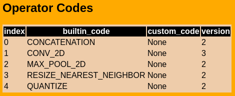

# Edge TPU - Tiny YOLO v3

This repository contains the instructions and scripts to run the Tiny YOLO-v3 on Google's Edge TPU USB Accelerator. Edge TPU can only run full quantized TF-Lite models. If you already have a converted model, simply run `inference.py` with `--quant` and `--edge_tpu` to test it.

    usage: Run TF-Lite YOLO-V3 Tiny inference. [-h] --model MODEL --anchors
                                           ANCHORS --classes CLASSES
                                           [-t THRESHOLD] [--edge_tpu]
                                           [--quant] [--cam] [--image IMAGE]
                                           [--video VIDEO] [--output OUTPUT_FILE]

    optional arguments:
      -h, --help            show this help message and exit
      --model MODEL         Model to load.
      --anchors ANCHORS     Anchors file.
      --classes CLASSES     Classes (.names) file.
      -t THRESHOLD, --threshold THRESHOLD
                            Detection threshold.
      --edge_tpu            Whether to delegate to Edge TPU or run on CPU.
      --quant               Indicates whether the model is quantized.
      --cam                 Run inference on webcam.
      --image IMAGE         Run inference on image.
      --video VIDEO         Run inference on video.
      --output OUTPUT_FILE  inference output file, video only.

**Note**: The inference code should be run on Tensorflow 1.15.0, even though the conversion below requires TF 2.0 nightly packages. I recommend using separate anaconda environments for inference and conversion.

___
# Conversion guide

### 1 - Convert darknet .weights to .tflite model
The network can be trained using either the original darknet implementation (https://github.com/pjreddie/darknet) or one of its forks (e.g. https://github.com/AlexeyAB/darknet). 

To run on Edge TPU, we need to convert the Keras model to TF-Lite and apply post-training full integer quantization. https://www.tensorflow.org/lite/performance/post_training_quantization.

**Important note:** The Edge TPU does not support the Leaky ReLU function, so it should be replaced by the regular ReLU. (https://coral.ai/docs/edgetpu/models-intro/#supported-operations) 

    python yolov3_to_tflite.py tiny-yolo-cfg.cfg darknet-weights.weights output-filename.tflite
    
    
**Note**: The quantization of the `RESIZE_NEAREST_NEIGHBOR (version 2)` op is only supported in Tensorflow 2.0 nightly packages as of now, so you need use that version for thconversion. 
    
    pip install tf-nightly-cpu==2.2.0.dev20200301
    
### 2 - Compile with Edge TPU compiler
Install the Edge TPU library and compiler: https://coral.ai/docs/edgetpu/compiler/.

Run the compiler on the TF-Lite quantized model:
    
    edgetpu_compiler quantized.tflite

If everything is correct you should get a log with every op mapped to Edge TPU:

    Edge TPU Compiler version 2.0.267685300
    Input: quantized.tflite
    Output: quantized_edgetpu.tflite
    Operator                       Count      Status
    RESIZE_NEAREST_NEIGHBOR        1          Mapped to Edge TPU
    MAX_POOL_2D                    6          Mapped to Edge TPU
    CONCATENATION                  1          Mapped to Edge TPU
    QUANTIZE                       4          Mapped to Edge TPU
    CONV_2D                        13         Mapped to Edge TPU

You can use visualize tool in tensorflow lite to inspect .tflite structure ([images/visualized_model.html](https://raw.githack.com/Air000/yolov3_to_edgetpu/master/images/visualized_model.html))

 
This model can be run on Edge TPU with `inference.py` script. Here use a bash script for inference, modify the script for your own test.

    bash run_inference.sh
